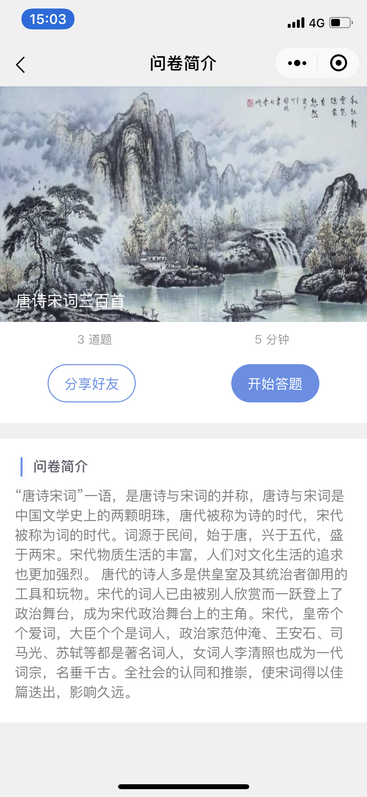
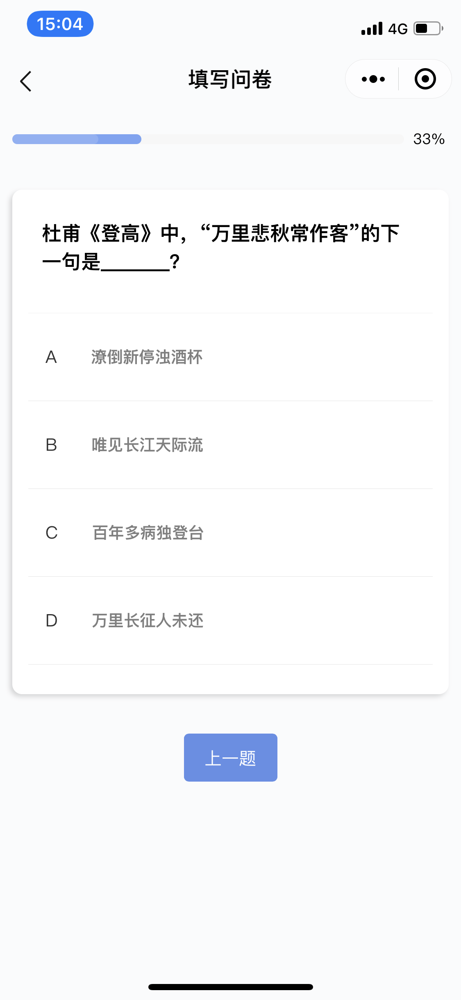
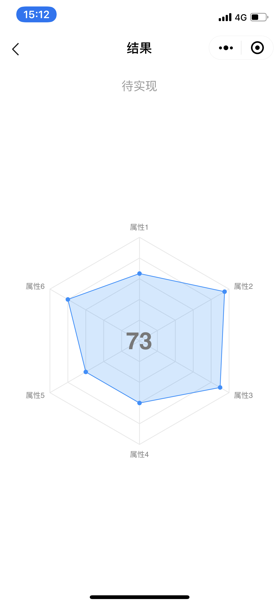

English | [简体中文](./README.zh-CN.md)

# patrick-wechat

⭐️🐟 questionnaire wechat app built with taro, taro-ui and heart❤️.

## Feature

1. 👽 Use [taro](https://github.com/NervJS/taro) framework for coding with React style.
2. 👨🏻‍💻 Use [taro-ui](https://github.com/NervJS/taro-ui) UI compoments to simplify UI building.
3. 👩🏻‍💻 Use [redux](https://github.com/reduxjs/redux) to completely manage app state.
4. 📈 Combine wechat with third party [f2](https://github.com/antvis/f2) to demonstrate charts usage.

## Develop

```bash
cd patrick-wechat

# install dependencies
yarn install

# install taro cli (v3)
yarn global add @tarojs/cli

# build and watch
yarn run dev:weapp
```

## Update

```bash
# update taro
taro update self

# update project
taro update project
```

## Deploy

```bash
# build and compress
yarn run build:weapp
```

## Upgrade To Taro 3.0

patrick-wechat has already upgrade to Taro V3, you can follow [THIS](https://taro-docs.jd.com/taro/docs/migration) instruction to complete the upgrade.
if you want to use Taro V2 version, please refer to [taro v2 branch](https://github.com/kennylbj/patrick-wechat/tree/taro-v2).

## Troubleshootting

1. Unable to run in Wechat Devtools after updating

  Delete the project and reimport it if it was already existed in your project list.

## Screenshots

<div align="center">
  
  
  
  
</div>

## Why Patrick

Patrick Star is a fictional character in SpongeBob SquarePants And he loves asking questions!

